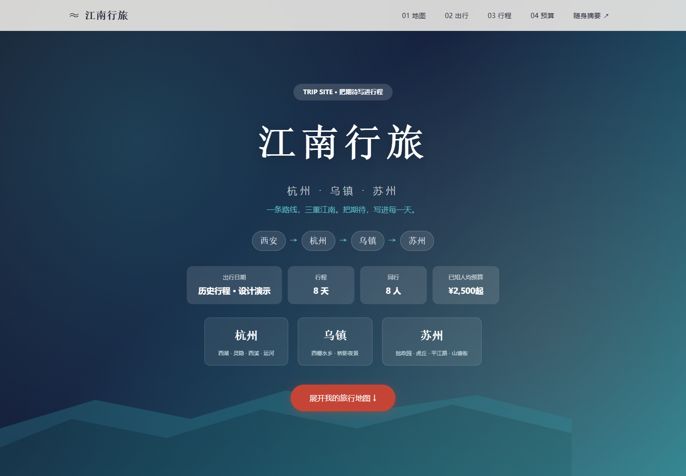
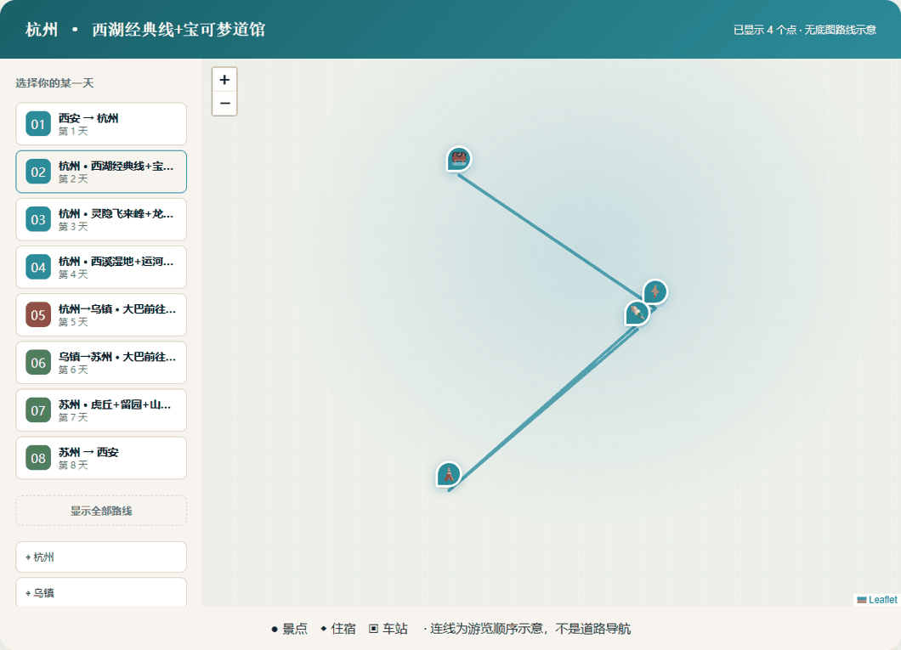
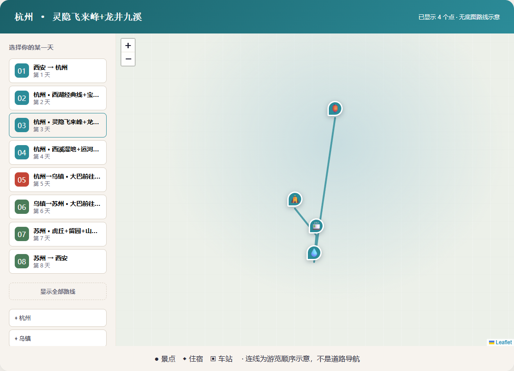

<p align="center">T C C　 /　 A I　造　物　计　划　0 1</p>

<h1 align="center">Trip Site · 把旅行攻略，做成一个网站</h1>

<p align="center">一览未来的行程。点开某一天，看路线、住宿、交通与预算。<br>把资料交给 AI，带走一份值得分享的旅行作品。</p>

<p align="center"><a href="https://tcc-trip-jiangnan.netlify.app/">看原版江南作品</a> · <a href="https://tstbswwswbst.github.io/tcc-trip-site/">体验通用模板</a> · <a href="https://github.com/tstbswwswbst/tcc-trip-site/releases/latest">下载 Skill 包</a> · <a href="docs/START-HERE.md">新手从这里开始</a></p>



## 先看它怎么用



<table><tr><td width="50%"><b>选择一天，路线就展开</b><br></td><td width="50%"><b>一天一页，时间线与地图相连</b><br></td></tr></table>

它继承了原版江南攻略的山峦首屏、青绿与朱红配色、地图侧栏和逐日行程。模板可以更换城市与天数；原始参考 HTML 也在 Skill 中，方便 AI 理解你的审美目标。

**一份数据，两种打开方式。** 完整网站负责展示和规划；随身摘要负责出门快速查阅。无需为了生成卡片再填一次表单。

| 精美网站 | 随身摘要 |
| --- | --- |
| 城市叙事、按天地图、地点弹窗、时间线 | 交通、住宿、每日要点、预算、打印 |
| 手机可用，电脑查看全景更舒服 | 适合手机快速查看，也能打印 |
| `index.html` | `card.html` |

## 不会写代码？把这一段交给能读写文件的 AI

先下载并解压 [Release](https://github.com/tstbswwswbst/tcc-trip-site/releases/latest) 中的 `trip-site-skill.zip`。在 WorkBuddy 等支持本地文件操作的 AI 工具中，打开或附上整个 `trip-site` 文件夹，再复制：

```text
请读取 trip-site/SKILL.md，帮我制作旅行攻略网站。
我的目的地是【填写目的地】，旅行【几天】，同行【几人】，
偏好是【慢游/亲子/摄影等】，预算【可先空着】。
下面是我已有的资料，请先帮我提取，不要让我重复填表：
【粘贴聊天记录、行程笔记或已脱敏的资料】

保留模板的首屏、按天地图、地点弹窗、每日时间线和预算。
缺失信息先标“待确认”；票价、班次、坐标不要编造。
请生成 index.html 和 card.html，并完成可执行的检查。
我希望用 Surge 发布。请先准备可公开的版本，
需要我首次登录时告诉我具体操作，登录后继续发布并给我真实链接。
```

AI 需要具备读取文件和执行脚本的能力，运行环境需要 Node.js 18+。只有聊天功能的模型，不能保证自动生成文件、运行检查和部署。**首次托管通常仍需你登录；这不是无限免费、匿名永久托管服务。** 完整操作见 [新手教程](docs/START-HERE.md)。

## 开发者：一条构建命令

```sh
node skills/trip-site/scripts/build.mjs skills/trip-site/assets/example.json output
```

无 npm 构建依赖。直接打开 `output/index.html` 即可预览，页面内附带 Leaflet，不依赖外部 CDN 加载地图交互。修改示例的副本后重新构建，就会同步更新网站和卡片。

```sh
npm test
```

输出含 `index.html`、`card.html`、`trip-card.json`、`build-report.json`。`trip-card.json` 可导入旧 trip-card 编辑器继续使用；预算不会被伪装成已付款 AA 记录。

## 地图和数据，哪些可以信？

- 示例是**历史设计演示**，票价、时间、班次和原稿坐标未重新核实，不是实时出行建议。
- 默认使用无底图路线示意：按天切换、地点弹窗、缩放与聚焦离线可用，路线不是道路导航。
- 原稿的高德兼容底图保留为 `meta.basemap="amap-legacy"` 选项，需要网络，并需使用者确认适用的服务授权。不要把“无需 API key”理解成“稳定无限免费”。生产地图服务应按服务商要求配置。
- 不明坐标系不会直接画到高德坐标画布；没有坐标仍有文字和搜索链接。导航通过高德地点链接打开，能否唤起 App 取决于设备。
- 预算区分人均和全团；未知费用标“待确认”，不按 0 元算。它不是预订系统或多人实时协作账本。

## 更多说明

| 我想做什么 | 去哪里 |
| --- | --- |
| 从下载到公开链接 | [新手教程](docs/START-HERE.md) |
| Surge / Netlify / GitHub Pages | [部署说明](skills/trip-site/references/deploy.md) |
| 调整城市、天数、预算 | [数据约定](skills/trip-site/references/data-contract.md) |
| 在 WorkBuddy 使用或发布 | [WorkBuddy 说明](docs/WORKBUDDY.md) |
| 看真实验证范围与限制 | [验收报告](docs/VALIDATION.md) |
| 报错或分享作品 | [Issues](https://github.com/tstbswwswbst/tcc-trip-site/issues) |

免费提供 Skill、模板、示例和基础教程，不要求付费或进群。欢迎分享你用它完成的作品；提交 Issue 前请去掉私人预订信息。

项目代码使用 [MIT License](LICENSE)。Leaflet 采用其 [BSD-2-Clause 许可证](skills/trip-site/assets/LEAFLET-LICENSE.txt)。原稿视觉来自作者提供的江南行旅 HTML；地图服务、商标及第三方内容不因本仓库开源而改变权利归属。
