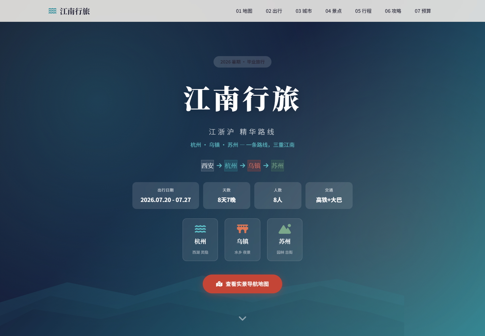
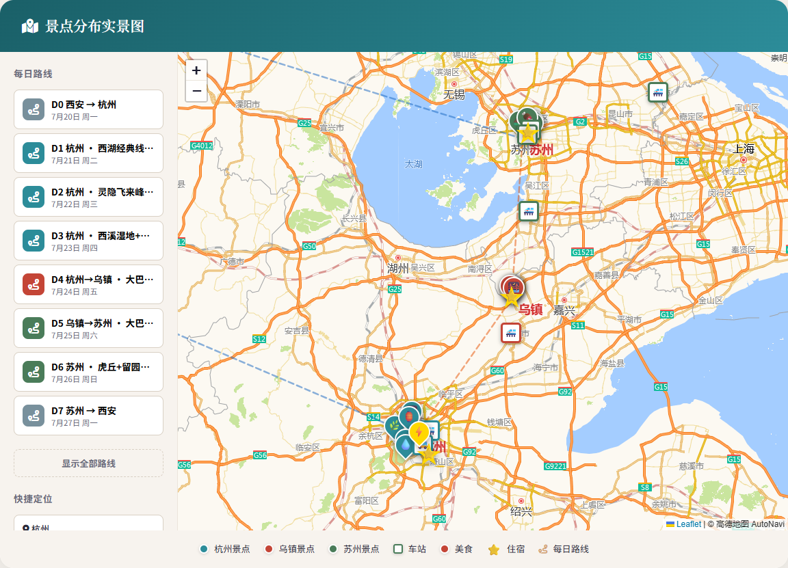

# 江南行旅 · 江浙沪毕业旅行攻略

这是一份可以直接在电脑和手机浏览器中打开的旅行攻略网站，围绕杭州、乌镇、苏州八天行程制作。

**在线浏览：** [打开江南行旅网站](https://tstbswwswbst.github.io/tcc-trip-site/)



## 网站内容

- 按天切换的交互地图与游览路线
- 城际交通、住宿和每日行程
- 景点、门票与开放时间
- 雨天备选、美食和出行提醒
- 人均费用预算
- 适配电脑和手机浏览器



## 仓库结构

```text
.
├── website/
│   └── jiangnan-refer.html   # 网站源文件
├── assets/
│   ├── hero.png              # README 首屏预览
│   └── map.png               # README 地图预览
├── .github/workflows/
│   └── pages.yml             # 自动发布网站
├── README.md
└── LICENSE
```

网站源文件是 [website/jiangnan-refer.html](website/jiangnan-refer.html)。GitHub Pages 发布时会将它作为网站首页，无需在仓库中额外保存一份重复的 `index.html`。

## 使用提醒

这份页面是具体行程的展示作品。门票、开放时间、车次、价格和地图信息可能变化，实际出行前请通过景区、铁路和地图平台再次确认。

后续经过人工检验的 Skill、教程或其他模板，会再按独立类别加入；当前仓库不包含未经确认的生成工具。
