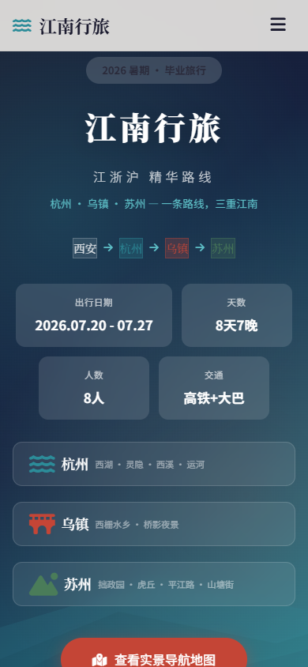

# Travel Guide Site · 把旅行攻略做成一个网站

输入出发地、目的地和天数，让 AI 生成一份适合电脑与手机浏览、可以直接分享的单文件旅行攻略网站。

**[在线体验江南 8 日示例](https://tstbswwswbst.github.io/tcc-trip-site/)** · **[下载已验证的 Skill 包](travel-guide-site.zip)** · **[查看 Skill 使用说明](skill/travel-guide-site/README.md)**


## 网站能展示什么

- **交互地图**：总览全部点位，也可按 Day 1–Day 8 查看当天路线
- **地点与导航**：景点、美食、酒店、车站分层显示，点击点位查看详情并跳转高德导航
- **完整行程**：城际交通、住宿、城市景点、门票、开放时间和逐日时间轴
- **旅行准备**：天气提示、行李清单、雨天备选和出行提醒
- **费用预算**：按交通、住宿、餐饮、门票等项目计算区间
- **多端适配**：桌面端完整展示，手机端可随时查看和导航


<p align="center">
  
</p>

## 三步生成自己的攻略

1. 下载并解压 [`travel-guide-site.zip`](travel-guide-site.zip)。
2. 在 **TRAE** 中放入 `.trae/skills/travel-guide-site/`；在 **WorkBuddy** 中通过当前版本的本地 Skill 导入入口选择解压后的文件夹。其他支持 Skill 的 AI 也可以读取 `SKILL.md`。
3. 对 AI 说：`帮我做一个攻略网站：从成都出发，去大理和丽江玩 6 天，2 个人，预算有限。`

Skill 会引导 AI 完成选点、路线、GCJ-02 坐标、页面生成、自检和公网部署。生成后请按包内说明运行：

```bash
node scripts/verify.js <生成的html路径>
```

看到 `PASS` 后再发布。SkillHub.cn 版本准备上架中；当前请以本仓库的 ZIP 为准。

## 仓库结构

```text
.
├── website/
│   └── template.html               # GitHub Pages 正在展示的完整示例
├── skill/travel-guide-site/        # 已验证的 Skill 源码与说明
├── assets/                         # README 图片与 GIF
├── .github/workflows/pages.yml     # 自动发布示例网站
├── travel-guide-site.zip           # 可直接下载导入的 Skill 包
├── README.md
└── LICENSE
```

Skill 目录中的 `README.md` 是下载包内部的使用手册，根目录的 `README.md` 是 GitHub 项目首页，两者用途不同。

## 发布自己的网页

生成结果是单个 HTML 文件，无需服务器，也无需一直开着电脑。可以使用 Netlify Drop、GitHub Pages 或 Surge 发布，详细步骤见 [`references/deployment.md`](skill/travel-guide-site/references/deployment.md)。

门票、开放时间、车次、价格和地图点位可能变化，实际出行前请通过景区、铁路和地图平台再次确认。

## License

MIT。你可以使用、修改并分享生成的网站。
