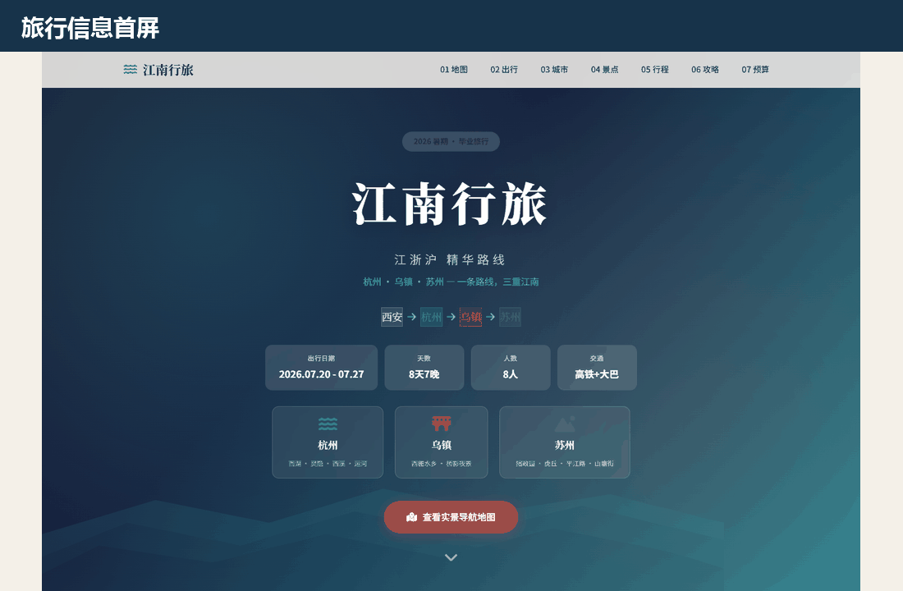
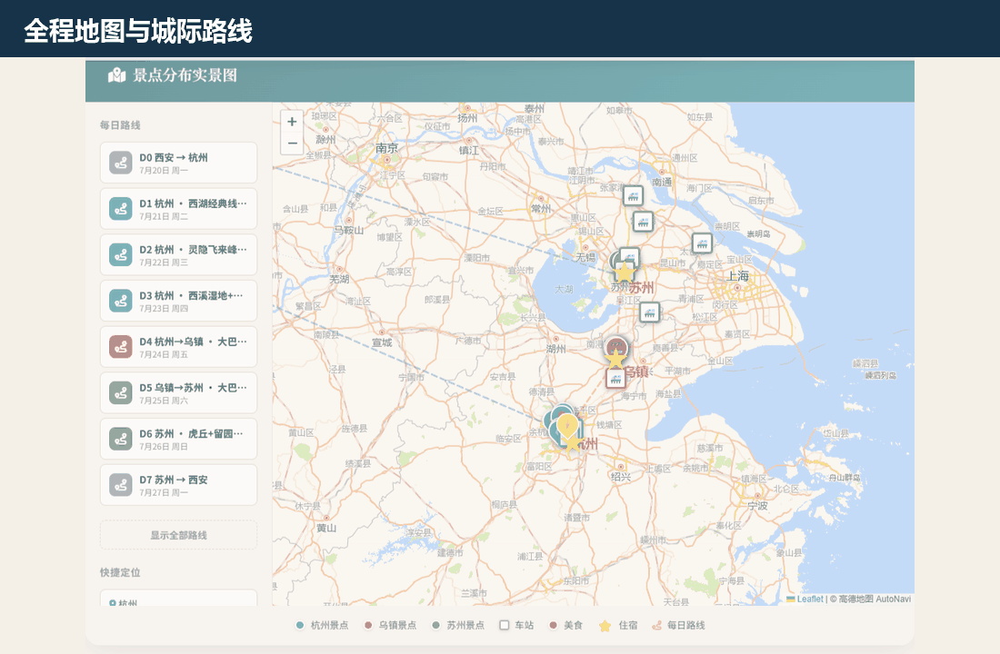
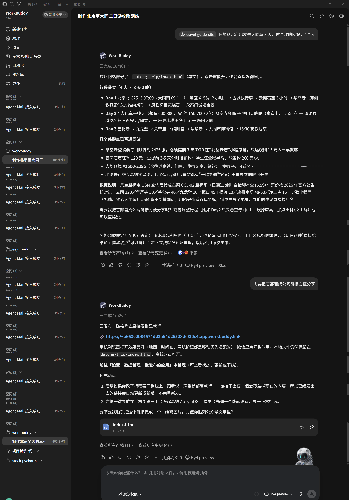
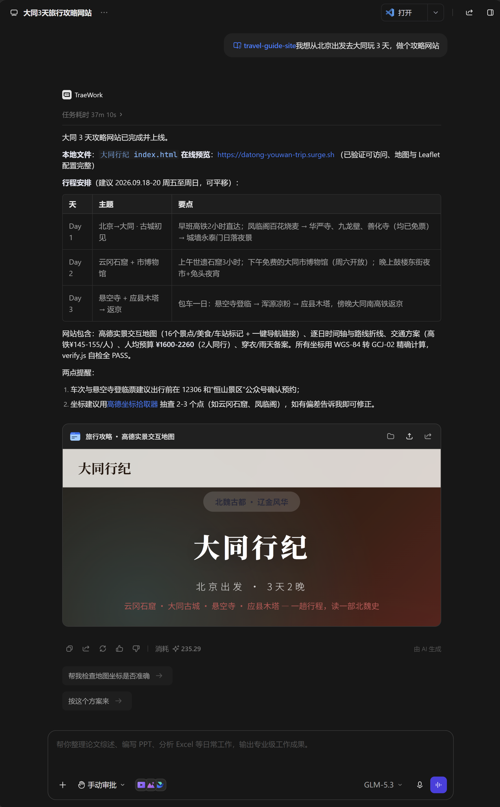

# Travel Guide Site · 把旅行攻略做成一个网站

输入出发地、目的地和天数，让 AI 生成一份适合电脑与手机浏览、可以直接分享的单文件旅行攻略网站。

**[在线体验江南 8 日示例](https://tstbswwswbst.github.io/tcc-trip-site/)** · **[下载已验证的 Skill 包](travel-guide-site.zip)** · **[查看 Skill 使用说明](skill/travel-guide-site/README.md)**



## 它能做出什么

- 🗺️ **高德实景交互地图**：景点、美食、酒店和车站分层显示，支持全部点位总览、按天路线切换与快捷定位
- 🧭 **一键导航**：点击地图点位查看详情，电脑打开高德网页版，手机可以唤起高德 App 导航
- 📅 **逐日行程时间轴**：每天几点出发、去哪里、吃什么，点击行程卡片查看完整安排
- 🚄 **交通与住宿方案**：展示去程、城际、返程、车次、耗时、价格区间和住宿建议
- 🏯 **城市与景点指南**：按城市切换景点，集中查看门票、开放时间、建议游玩时长和实用说明
- 🍜 **美食指南**：各城市老字号、招牌菜和用餐安排可进入独立地图图层
- 💰 **费用预算**：按交通、住宿、餐饮和门票等项目计算 low/high 区间
- 🧳 **出行准备**：包含天气提示、行李清单、雨天备选与注意事项
- 📱 **手机完整适配**：可以在旅途中随时查看路线、时间和导航入口



### 手机端也能完整使用

<p align="center"></p>

## 两个真实生成案例

以下网页都由本仓库的 `travel-guide-site` Skill 与 AI 对话生成，并保留了交互过程截图和最终 HTML。

### WorkBuddy · HY4｜晋北三日游

**[打开公开网站](https://6a663e2b84574dd2a64d26528de8f0c4.app.workbuddy.link)** · **[查看生成的 HTML](examples/workbuddy-hy4-晋北三日游/index.html)**

使用 WorkBuddy 中的 HY4，根据旅行需求生成路线、景点、交通、地图点位和网页。

<p align="center"></p>

### TRAE · GLM｜大同三日游

**[打开公开网站](https://datong-youwan-trip.surge.sh/)** · **[查看生成的 HTML](examples/TRAE-GLM-大同三日游/index.html)**

使用 TRAE 中的 GLM 调用同一 Skill 生成网站。新版校验器会在出发地被放入 `cities` 时给出 `WARN` 和判断指引，但不会阻断部署。

<p align="center"></p>

## 三步生成自己的攻略

1. 下载并解压 [`travel-guide-site.zip`](travel-guide-site.zip)。
2. 在 **TRAE** 中放入 `.trae/skills/travel-guide-site/`；在 **WorkBuddy** 中通过当前版本的本地 Skill 导入入口选择解压后的文件夹。其他支持 Skill 的 AI 也可以读取 `SKILL.md`。
3. 对 AI 说：`帮我做一个攻略网站：从成都出发，去大理和丽江玩 6 天，2 个人，预算有限。`

Skill 会引导 AI 完成选点、路线、GCJ-02 坐标、页面生成、自检和公网部署。生成后必须按包内说明运行：

```bash
node scripts/verify.js <生成的html路径>
```

校验输出可能包含用于人工判断的 `WARN`；只要没有 `FAIL` 并最终出现 `PASS`，即可继续部署。SkillHub.cn 版本准备上架中；当前请以本仓库的 ZIP 为准。

## 仓库结构

```text
.
├── website/
│   └── template.html               # GitHub Pages 正在展示的完整示例
├── skill/travel-guide-site/        # 已验证的 Skill 源码与说明
├── examples/                       # WorkBuddy HY4 与 TRAE GLM 生成案例
├── assets/                         # README 图片与 GIF
├── .github/workflows/pages.yml     # 自动发布示例网站与案例
├── travel-guide-site.zip           # 可直接下载导入的 Skill 包
├── README.md
└── LICENSE
```

Skill 目录中的 `README.md` 是下载包内部的使用手册，根目录的 `README.md` 是 GitHub 项目首页，两者用途不同。

## 发布自己的网页

生成结果是单个 HTML 文件，无需服务器，也无需一直开着电脑。可以使用 Netlify Drop、GitHub Pages 或 Surge 发布，详细步骤见 [`references/deployment.md`](skill/travel-guide-site/references/deployment.md)。

门票、开放时间、车次、价格和地图点位可能变化，实际出行前请通过景区、铁路和地图平台再次确认。

## License

MIT。你可以使用、修改并分享生成的网站。
